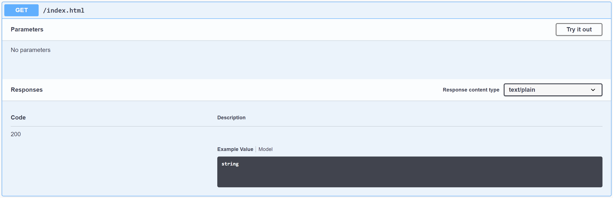
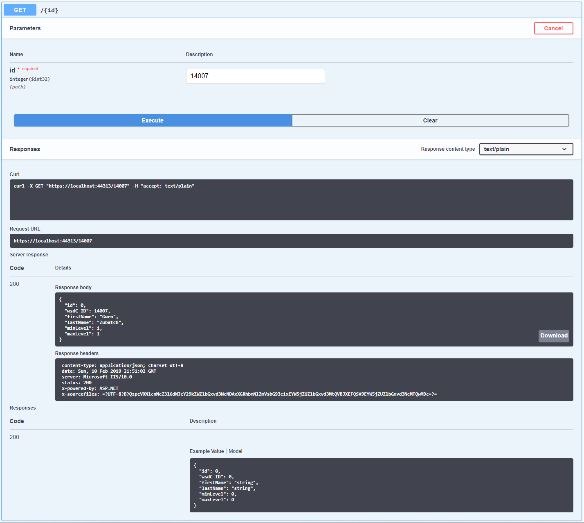
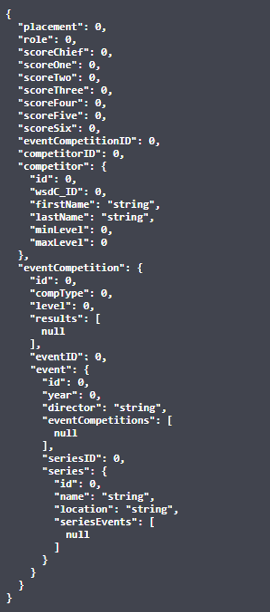
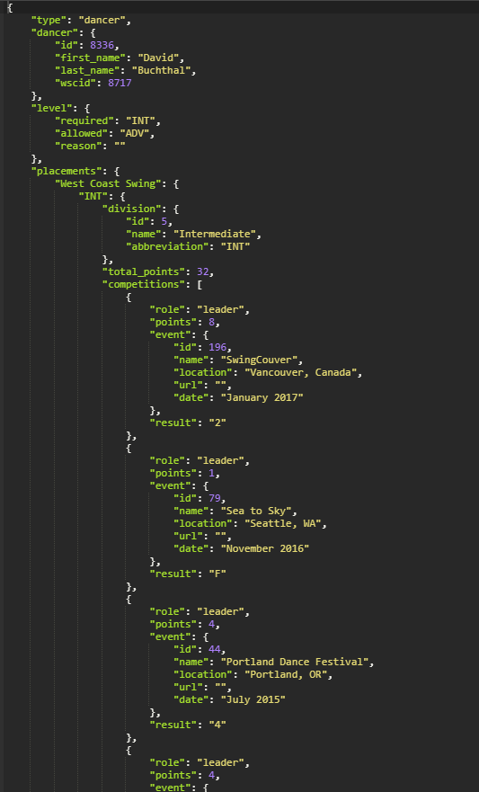

# Dance Fellows (API)

## Overview
This application provides an access point for official World Swing Dance Council (WSDC) competitor data, and a respository for competition data when used by a properly configured, event-specific web application.

## Deployed API
https://dancefellowsapi.azurewebsites.net/

## Routes
This application uses NSwag to expose routes and models. Outputs are shown below - they can be directly accessed by visiting the SwaggerUI at https://localhost:44313/swagger/index.html.

### GET /index.html
This route is a simple 'Hello World' landing page. It offers no feature data, but it is a visual verification that the site is functional and accessible.

### GET /{id}
This route returns data for a single competitor, if present in the database. The 'id' in this case is WSDC competitor ID#.

### POST /Results/Create
This route creates a new registration record linking a competitor to a specific competition. It accepts a list of 3 objects containing these required key/value pairs (at minimum - other data will be ignored):

  1ST OBJECT (list index 0):  
    - "CompType" <int> - competition type (enum: 0=Jack & Jill, 1=Strictly, 2=Classic, 3=Showcase, 4=Rising Star)  
    - "Level" <int> - competition level (enum: 0=Newcomer, 1=Novice, 2=Intermediate, 3=Advanced, 4=All-Star, 5=Champion)  
  2ND OBJECT (list index 1):  
    - "WSC_ID" <int> - competitor's WSDC ID  
  3RD OBJECT (list index 2):  
    - "EventID" <int> - ID issued to client by API to enable use of API's results tracking resources  
    - "Role" <int> - competitor's dance role (enum: 0=Lead, 1=Follow)  
    - "Placement" <int> - final placement (enum: 0=Point finalist, 1=5th place, 2=4th place, 3=3rd place, 4=2nd place, 5=1st place )  
    - "ChiefJudgeScore" <int> - raw score by Chief Judge  
    - "JudgeOneScore" <int> - raw score  
    - "JudgeTwoScore" <int> - raw score  
    - "JudgeThreeScore" <int> - raw score  
    - "JudgeFourScore" <int> - raw score  
    - "JudgeFiveScore" <int> - raw score  
    - "JudgeSixScore" <int> - raw score  
     
    

### PUT /Results/Update
This route updates an existing registration record linking a competitor to a specific competition. 'Existing' is determined by a composite of WSC_ID, CompType, Level, and EventID). It accepts the same data package as /Results/Create.

### POST /Results/Delete
This route deletes an existing registration record linking a competitor to a specific competition. 'Existing' is determined by a composite of WSC_ID, CompType, Level, and EventID). It accepts the same data package as /Results/Create and /Update.

## Architecture
This simplified ASP.NET Core API is built atop a SQL database (see details and schema below) seeded with WSDC-official competitor data (collected from https://points.worldsdc.com/lookup/find):
  
  
This API relies on Entity Framework Core for object relational mapping (ie - deriving a database context from object models), which enables easy integration of object-oriented programming with data management tasks. The DB transactional features are isolated to the Competitors and Results tables - each has an associated controller (with routes described above).
  
So that future enhancements are less invasive (with respect to the codebase), this API makes use of the repository design pattern to decouple the data source and the manipulation logic. This is achieved by use of controller interfaces that explicitly list DB transactional features and associated services that handle those transactions on behalf of the controllers, acting as a proxy DB context specifically for that controller's use.  Should new tables, features, or behaviors be needed, or should the DB get replaced or migrated to a new technology, the development work will isolated to those interface points (instead of throughout the code base, as is the case for tightly coupled designs).  
  

## Testing
This project uses xUnit for unit testing for all class members and database transactions. Unit tests verify proper get and set behaviors for all table properties, and proper behavior of all xManagementService methods.

## Future Vision
The database is built with the intent of enabling future modular enhancements. The Competitors and Results tables have associated client-initiated transactions and routes, so controllers (and interfaces/services) are built to target them. The Event, EventCompetitions, and Series tables are structural (ie - supporting) currently, but they will be used in the future to host client-accessible services such as:
  - launching new events
  - creating and removing competitions for a given event
  - creating a new annual series of events
  - scorekeeping and calculations in accordance with WSDC rules
  - end-of-event results submission to WSDC
  - storage and recovery of event details and results

## Credit
Dance Fellows has been a collaborative effort by:
  Andrew Quamme https://github.com/andrewquamme  
  Blaise Clark https://github.com/Dervival  
  Jason Hiskey https://github.com/jlhiskey  
  Gwen Zubatch https://github.com/GwennyB  

